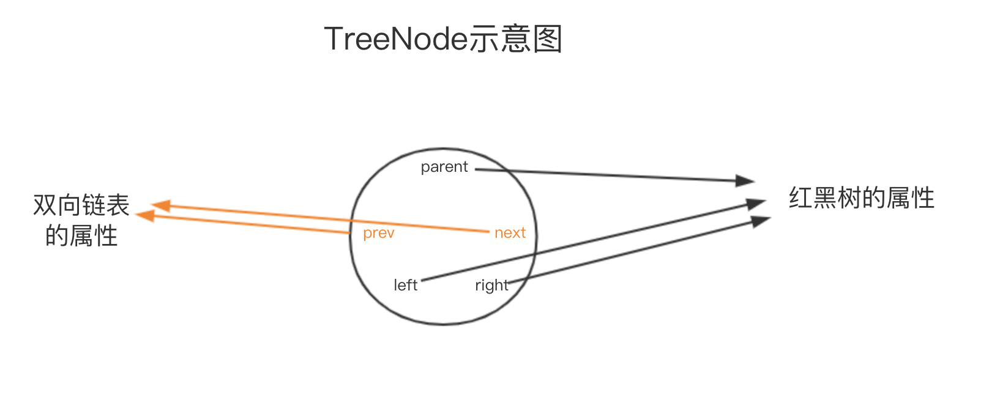
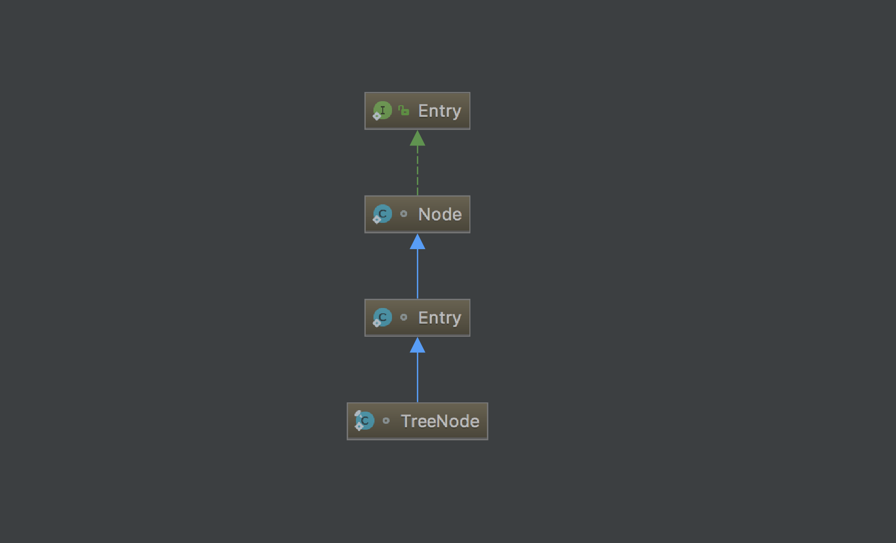
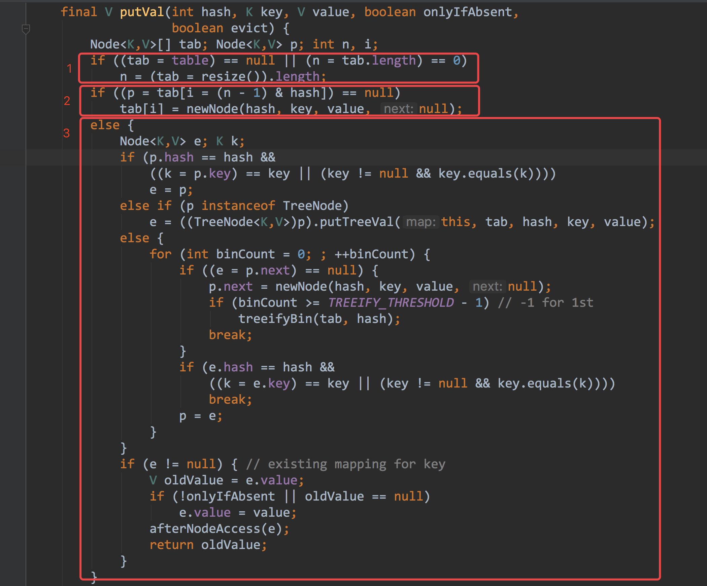
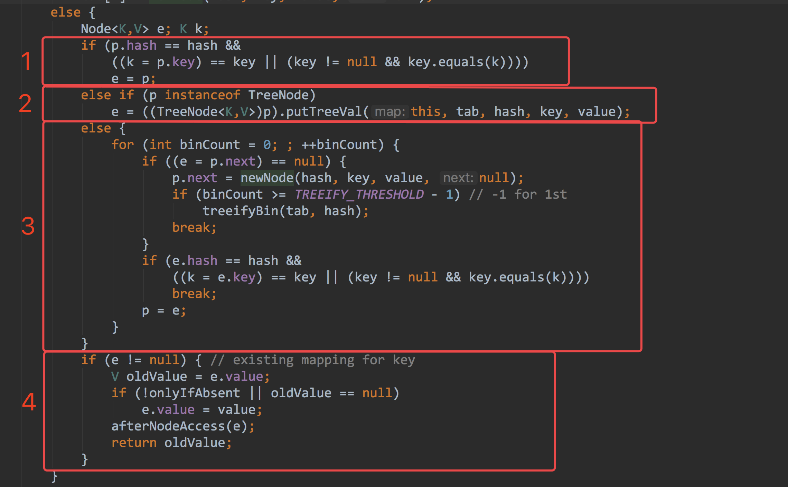

# HashMap的成员属性

```java
//数组的默认初始化容量
static final int DEFAULT_INITIAL_CAPACITY = 1 << 4;
//哈希表的最大容量
static final int MAXIMUM_CAPACITY = 1 << 30;
//默认的加载因子
static final float DEFAULT_LOAD_FACTOR = 0.75f;
//链表转红黑树的阈值
static final int TREEIFY_THRESHOLD = 8;
//红黑树转链表的阈值
static final int UNTREEIFY_THRESHOLD = 6;
//最小树化容量
static final int MIN_TREEIFY_CAPACITY = 64;
//数组
transient Node<K,V>[] table;
transient Set<Map.Entry<K,V>> entrySet;
//哈希表的大小
transient int size;
//扩容的阈值
int threshold;
//加载因子
final float loadFactor;
```


# HashMap中重要的内部类

#### 链表中的节点Node

Node.next 维护着链表中下一个节点的引用，HashMap使用链地址法处理hash冲突。

[处理hash冲突的主要方法可以参考该文章](https://www.cnblogs.com/zhangbing12304/p/7997980.html)

```java
static class Node<K,V> implements Map.Entry<K,V> {
    final int hash; //当前节点的Hash值
    final K key;
    V value;
    Node<K,V> next;//单向链表，维护着链表中下一个节点的引用
}
```

#### 红黑树中的节点TreeNode

```java
static final class TreeNode<K,V> extends LinkedHashMap.Entry<K,V> {
    TreeNode<K,V> parent; //父节点
    TreeNode<K,V> left;	//左子节点		
    TreeNode<K,V> right; //右子节点
    TreeNode<K,V> prev; //前驱节点
    boolean red; //红黑树节点的颜色
}
```





#### TreeNode和Node的类关系图





# HashMap的构造器

#### 1、指定初始化容量initialCapacity

```java
    public HashMap(int initialCapacity) {
        this(initialCapacity, DEFAULT_LOAD_FACTOR);
    }
```

#### 2、无参

```java
    public HashMap() {
        this.loadFactor = DEFAULT_LOAD_FACTOR; //使用默认加载因子
    }
```

#### 3、传入一个Map

```java
	public HashMap(Map<? extends K, ? extends V> m) {
        this.loadFactor = DEFAULT_LOAD_FACTOR;
        putMapEntries(m, false);
    }
```

#### 4、指定初始化容量initialCapacity和加载因子loadFactor

```java
	public HashMap(int initialCapacity, float loadFactor) {
        if (initialCapacity < 0)
            throw new IllegalArgumentException("Illegal initial capacity: " +
                                               initialCapacity);
        if (initialCapacity > MAXIMUM_CAPACITY)
            initialCapacity = MAXIMUM_CAPACITY;
        if (loadFactor <= 0 || Float.isNaN(loadFactor))
            throw new IllegalArgumentException("Illegal load factor: " +
                                               loadFactor);
        this.loadFactor = loadFactor;
        this.threshold = tableSizeFor(initialCapacity);
	}
```


```java
/**
* HashMap要求数组的长度必须为2的n次方，如果用户传入的初始化容量initialCapacity不是2的n次方，则通过
* tableSizeFor方法是将其转换成大于输入的initialCapacity且最近的2的整数次幂的数。
* 比如用户传入的initialCapacity为10，则通过调用tableSizeFor方法会将其转换成16
*/
static final int tableSizeFor(int cap) {
    int n = cap - 1;
    n |= n >>> 1;
    n |= n >>> 2;
    n |= n >>> 4;
    n |= n >>> 8;
    n |= n >>> 16;
    return (n < 0) ? 1 : (n >= MAXIMUM_CAPACITY) ? MAXIMUM_CAPACITY : n + 1;
}
```

如果不明白方法的算法[请查看这篇文章](https://www.cnblogs.com/loading4/p/6239441.html)


# HashMap插入过程的源码分析

#### put(K key,V value)方法

```java
public V put(K key, V value) {
    return putVal(hash(key), key, value, false, true);
}
```

调用putval方法之前调用了hash()方法用来计算key的hash值， hash(Object key)方法如下：

```java
static final int hash(Object key) {
    int h;
    return (key == null) ? 0 : (h = key.hashCode()) ^ (h >>> 16);
}
```

可以看到计算hash值的逻辑是：

​	如果key为null，则hash值为0

​	如果key不为null，则用key的hashCode高16位于低16位进行逻辑异或，得到的结果就是key的hash值。

不直接用hashCode做hash值，而是采用了高低位异或的方式计算hash值的原因请[查看这篇文章](https://www.zhihu.com/question/20733617)


#### putVal(int hash, K key, V value, boolean onlyIfAbsent,boolean evict)方法

```java
final V putVal(int hash, K key, V value, boolean onlyIfAbsent,
               boolean evict) {
    Node<K,V>[] tab; Node<K,V> p; int n, i;
    if ((tab = table) == null || (n = tab.length) == 0)	//表示数组未初始化
        n = (tab = resize()).length;					//初始化数组
    //如果对应的桶中没有元素，则将当前key，value封装成节点放入桶中
    if ((p = tab[i = (n - 1) & hash]) == null)
        tab[i] = newNode(hash, key, value, null);
    else {//进入else表示对应的桶中已经了元素，此时的数据结构要么是链表要么是红黑树
        Node<K,V> e; K k;
        //key已经存在，拿到节点等待后续替换value值
        if (p.hash == hash && ((k = p.key) == key || (key != null && key.equals(k))))
            e = p;
        else if (p instanceof TreeNode)	//当前已经是树结构了，将(key，value)封装成Node插入到红黑树中
            e = ((TreeNode<K,V>)p).putTreeVal(this, tab, hash, key, value);
        else {//链表结构
            for (int binCount = 0; ; ++binCount) {
                //表示已经遍历到链表的尾部，没有发现相同的key，则将key，value封装成节点插入到链表中
                if ((e = p.next) == null) {
                    p.next = newNode(hash, key, value, null);
                    if (binCount >= TREEIFY_THRESHOLD - 1) 
                        treeifyBin(tab, hash);//如果链表长度达到树化的临界值，则将链表转成红黑树
                    break;
                }
                //表示在链表中发现了相同的key的节点，则获取节点等待后续替换value值
                if (e.hash == hash &&
                    ((k = e.key) == key || (key != null && key.equals(k))))
                    break;
                p = e;
            }
        }
        if (e != null) { //表示链表中存在当前key的节点
            V oldValue = e.value;
            if (!onlyIfAbsent || oldValue == null)
                e.value = value;//替换key相同的节点的value
            afterNodeAccess(e);//钩子函数，在这里没卵用
            return oldValue;
        }
    }
    ++modCount;
    if (++size > threshold)
        resize();
    afterNodeInsertion(evict);
    return null;
}
```



如上图所示，可以将putVal方法分为3部分：

1、程序进入方框1处的代码表示当前数组未初始化，则调用resize()方法对其进行初始化操作

2、程序进入方框2处的代码表示当前数组已经初始化，且要插入的桶中没有节点元素，于是将key，value键值对封装成一个Node节点，并将其放入到对应的桶中。

3、程序进入方框3处的代码表示数组已经初始化并且对应的桶中已经有了节点，这时桶中的数据结构要么为链表，要么为红黑树。

​	如果数据结构为链表，则开始遍历链表，查找当前key在链表中是否已经存在，如果存在则对其节点的value	值进行更新，如果key在链表中不存在，则将其追加到链表的尾部，追加完成后判断是否需要将链表转换成红黑树。

​	如果数据结构为红黑树，则调用红黑树的pitTreeVal方法将当前key，value键值对存入红黑树中。


接下来重点分析方框3中的代码：

​	

此处又将其分为4个部分，下面分别分析：

​	1、判断桶的头节点的hash值和key是否和要插入节点的hash和key值相等，如果相等，则直接替换元素的value值即可，替换操作在方框4中完成

​	2、如果桶的头结点类型是红黑树的节点类型，即继承自LinkedHashMap.Entry<K,V>的TreeNode，则调用红黑树的putTreeVal方法将当前键值对插入到红黑树中

​	3、进入方框3中的代码块则表示当前桶中的数据结构是单向链表，那么就遍历链表进行比较替换或追加操作

​	4、进入该代码块则表示上面的步骤中在链表中找到了hash和key相同的节点，在这里对其value值进行替换操作。这里的逻辑和HashMap的replace(K key, V value)方法的逻辑相同。


上面的1和4都很简单，下面重点说一下2和3中的树化链表


# 链表转红黑树

从putVal方法的实现中可以看到，当链表的长度大于TREEIFY_THRESHOLD(8)时，将会调用treeifyBin(Node<K,V>[] tab, int hash)方法将当前链表转换成红黑树结构。

链表转红黑树的大致逻辑是

(1)现将链表中的Node元素转换成红黑树中Node元素，并将单向链表转换成双向链表

(2)从头节点开始遍历当前双向链表，并将其插入到红黑树中合适的位置，为了保持红黑树的平衡，每次插入都会调用相应的方法对红黑树进行自平衡操作。

(3)调节桶中元素，使其指向红黑树的根节点。因为每次对红黑树进行自平衡操作红黑树的结构都有可能发生变化，所以每次都需要调节桶中的的头结点，使其指向红黑树的根节点。

### treeifyBin(Node<K,V>[] tab, int hash)

treeifyBin方法的主要作用是：

1、遍历链表将链表中的Node节点转换成红黑树的节点TreeNode

2、将原来的单向链表转换成双向链表

```java
final void treeifyBin(Node<K,V>[] tab, int hash) {
    int n, index; Node<K,V> e;
    //如果小于最小树化容量MIN_TREEIFY_CAPACITY(64)，则放弃树化链表，转而对其进行扩容
    if (tab == null || (n = tab.length) < MIN_TREEIFY_CAPACITY)
        resize();
    else if ((e = tab[index = (n - 1) & hash]) != null) {//e为桶中链表的头元素
        TreeNode<K,V> hd = null, tl = null;//hd为头结点，tl为尾节点
        do {//将链表的Node替换成树的TreeNode，并将其连接起来(双向链表)
            TreeNode<K,V> p = replacementTreeNode(e, null);
            if (tl == null)
                hd = p;
            else {
                p.prev = tl;
                tl.next = p;
            }
            tl = p;
        } while ((e = e.next) != null);
        
        if ((tab[index] = hd) != null)//用转换后的链表的头结点(TreeNode)替换原先链表的头结点(Node)
            hd.treeify(tab);//开始将链表转换成红黑树
    }
}
```


### treeify(Node<K,V>[] tab)

treeify方法的主要逻辑为：

​	(1)将要插入的节点插入到红黑树中合适插入点中

​		假设要插入的节点为x，递归到的节点为p，判断插入点的大致逻辑是：

​			1.1 从根节点开始递归向下判断节点X的hash值与p节点的大小关系，直到找到正确的插入点

​					如果x的hash值大于p的hash值，则x节点应该插入到p节点的右侧

​					如果x的hash值小于p的hash值，则x节点应该插入到p节点的左侧	

​			1.2 如果节点x和节点p的hash值相等，接下来应该判断的是两个节点的key之间的关系，这时有两种				

​			情况：

​				1.2.1 如果key实现了Comparable接口，则调用实现的compareTo方法判断两个key的大小关系

​				1.2.2 如果key没有实现Comparable接口，这时就没法比较了，此时会调用tieBreakOrder方法		

​				对其进行最后一轮比较(tieBreak意为"抢七局")，这一轮的比较会比较两个key的类名，如果类		

​				名还相等，那就调用System.identityHashCode方法判断，这次一定会得到结果。​		

​	(2)因为每次插入后都有可能破坏红黑树的平衡，所以需要调用balanceInsertion方法对红黑树进行修复

​	(3)红黑树的修复过程可能会导致树的根节点发生变化，故需要调用moveRootToFront方法将调节桶中的头元素，使其指向树的root节点

```java
final void treeify(Node<K,V>[] tab) {
    TreeNode<K,V> root = null;
    //遍历treeifyBin方法中转换后的链表
    for (TreeNode<K,V> x = this, next; x != null; x = next) {
        next = (TreeNode<K,V>)x.next;
        x.left = x.right = null;
        if (root == null) {//表示当前红黑树是空树
            x.parent = null;//根节点的父节点肯定为null
            x.red = false;//根节点的颜色为黑色
            root = x;
        }
        else {
            K k = x.key;
            int h = x.hash;
            Class<?> kc = null;
            for (TreeNode<K,V> p = root;;) {
                int dir, ph;
                K pk = p.key;
                //判断当前节点应该被插入到红黑树的哪个位置
                //dir为标志位，如果dir为-1，则表示应该插入到左子节点，dir为1表示应该插入到右子节点
                if ((ph = p.hash) > h)
                    dir = -1;
                else if (ph < h)
                    dir = 1;
                //下面用来判断当两个节点的hash值相同时，dir应该为-1还是1。
                //假设当前key的类的定义为     
                //	class Demo implements Comparable<Demo>{
                //		...
            	//	}
                //comparableClassFor(k) 方法的作用是通过反射获取Comparable<Demo>中的泛型类型Demo
                //compareComparables(kc, k, pk)方法的作用是通过反射调用compareTo方法比较两个key
                else if ((kc == null &&(kc = comparableClassFor(k)) == null) ||
                         (dir = compareComparables(kc, k, pk)) == 0)
                    dir = tieBreakOrder(k, pk);//抢七大战

                //将节点插入到红黑树的对应位置
                TreeNode<K,V> xp = p;
                if ((p = (dir <= 0) ? p.left : p.right) == null) {
                    x.parent = xp;
                    if (dir <= 0)
                        xp.left = x;
                    else
                        xp.right = x;
                    //因为插入节点可能会导致红黑树的性质被破坏，所以在此处进行插入修复操作
                    root = balanceInsertion(root, x);
                    break;
                }
            }
        }
    }
    moveRootToFront(tab, root);//将红黑树的根元素root移动到桶中链表的头部，这里为什么还是链表结构，不应								//该是红黑树结构吗？ 红黑树只是一个逻辑结构，在内存中实际存储的形式还是上								//面转化后的双向链表
}
```


如果对反射操作不太熟悉，看不懂comparableClassFor(k)和compareComparables(kc, k, pk)方法的逻辑，可以[查看这篇文章](https://blog.csdn.net/JustBeauty/article/details/81116144)

​	

### balanceInsertion(TreeNode<K,V> root,  TreeNode<K,V> x)

关于红黑树插入修复的分析可以[看我的另一篇文章](https://blog.csdn.net/qq_35835624/article/details/100314988)，这里不再解释

```java
/**
* 红黑树插入的自平衡
*	
*/
static <K,V> TreeNode<K,V> balanceInsertion(TreeNode<K,V> root,
                                            TreeNode<K,V> x) {
    x.red = true;//插入节点的颜色默认为红色
    //xp,插入节点的父节点
    //xpp，插入节点的爷爷节点
    //xppl，插入节点爷爷节点的左子节点
    //xppr，插入节点爷爷节点的右子节点
    for (TreeNode<K,V> xp, xpp, xppl, xppr;;) {
        if ((xp = x.parent) == null) { //此时红黑树是空树，所以直接将颜色染成黑色即可
            x.red = false;
            return x;
        }
        else if (!xp.red || (xpp = xp.parent) == null)//父节点就是根节点，不用自平衡
            return root;
        
        if (xp == (xppl = xpp.left)) {  //父节点是爷爷节点的左子节点
            if ((xppr = xpp.right) != null && xppr.red) {//情况3.1 叔节点为红色暗示父节点也一定是红色
                xppr.red = false;
                xp.red = false;
                xpp.red = true;
                x = xpp;//递归向上继续自平衡
            }else {
                if (x == xp.right) {//对应于情况3.3，此时先左旋将问题转换成情况3.2
                    root = rotateLeft(root, x = xp);
                    xpp = (xp = x.parent) == null ? null : xp.parent;
                }
                if (xp != null) {//对应于情况3.2
                    xp.red = false;
                    if (xpp != null) {
                        xpp.red = true;
                        root = rotateRight(root, xpp);
                    }
                }
            }
        }
        else {//父节点是爷爷节点的右子节点，处理逻辑是上面的镜像情况
            if (xppl != null && xppl.red) {
                xppl.red = false;
                xp.red = false;
                xpp.red = true;
                x = xpp;
            }
            else {
                if (x == xp.left) {
                    root = rotateRight(root, x = xp);
                    xpp = (xp = x.parent) == null ? null : xp.parent;
                }
                if (xp != null) {
                    xp.red = false;
                    if (xpp != null) {
                        xpp.red = true;
                        root = rotateLeft(root, xpp);
                    }
                }
            }
        }
    }
}
```


### moveRootToFront(Node<K,V>[] tab, TreeNode<K,V> root) 

```java
static <K,V> void moveRootToFront(Node<K,V>[] tab, TreeNode<K,V> root) {
    int n;
    if (root != null && tab != null && (n = tab.length) > 0) {
        int index = (n - 1) & root.hash;
        TreeNode<K,V> first = (TreeNode<K,V>)tab[index];//获取桶中的头结点
        if (root != first) {//桶中的头结点和树的根节点不相等，则表示要
            Node<K,V> rn;//rn 根节点在双向链表的下一个节点
            tab[index] = root;
            TreeNode<K,V> rp = root.prev;//rp 根节点在双向链表的上一个节点
            //将根节点的位置从链表中的某个位置移动到链表的最前端
            if ((rn = root.next) != null)
                ((TreeNode<K,V>)rn).prev = rp;
            if (rp != null)
                rp.next = rn;
            if (first != null)
                first.prev = root;
            root.next = first;
            root.prev = null;
        }
        assert checkInvariants(root);
    }
}
```


